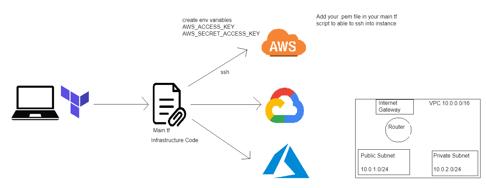

## Terraform

## What is Terraform?

Terraform is a tool that allows you to define and manage your computer infrastructure as code. It lets you create, update, and delete your infrastructure resources, such as servers, databases, and networks, by writing code rather than clicking through a graphical user interface. This approach, called infrastructure as code (IAC), makes it easier to automate and manage your infrastructure efficiently and consistently, whether you're working in the cloud, on-premises, or in a hybrid environment.

## Why use Terraform?

Terraform Benefits:

Automation: Streamlines infrastructure management <br>
Infrastructure as Code (IAC): Defines infrastructure using code <br>
Multi-Cloud Support: Works across various cloud providers <br>
Consistency: Ensures uniformity in configurations <br>
Scalability: Easily adjusts to changing demands <br>
Modularity: Encourages code reuse and best practices <br>
State Management: Tracks infrastructure changes accurately <br>
Community and Ecosystem: Offers a supportive community and extensive library of resources <br>

## Who is using Terraform?

Terraform is widely used by a diverse range of organizations and professionals in the fields of DevOps, cloud computing, infrastructure management, and more

**Tech Giants**: Microsoft, Google, AWS <br>

**Government and Public Sector**: Government agencies and organizations in the public sector adopt Terraform for secure and compliant infrastructure management

## Downloading and Installing Terraform

**Step 1**: Download Terraform from the website and unzip to get the `terraform.exe` file, move this to the Windows PATH `C:/Windows/System32 `

**Step 2**: Open a GitBash Terminal and type `terraform` then `terraform --version`

### Using Terraform to Start an EC2 Instance on AWS

Create a new file `nano main.tf`

```
# Who is the provider
provider "aws" {


# location of aws
   region = "eu-west-1"

}
# to download required dependencies
# create a service/resource on the cloud - ec2 on AWS

resource "aws_instance" "shaluo-tech254-iac" {
    ami = "ami-0f31088b1d3e180d3"
    instance_type = "t2.micro"
    tags = {
     Name = "shaluo-tech254-iac"
    }
}
```
## Setting up Variable Names

Instead of naming the AMI and location of the AWS inside the `main.tf` file we can create a new Terraform file with our variables inside of it like this: 
```
variable "aws-region" {
    default = "eu-west-1"
}
variable "web-app_ami_id" {
    default = "ami-0bf42f777408d129a"
}
```
This can then be called in the `main.tf` file like this:

```
region = var.aws-region
```
## Creating a VPC through Terraform

```
# Who is the provider
provider "aws" {
# location of aws
   region = var.aws-region
}
# Create a VPC
resource "aws_vpc" "shaluo_vpc2" {
  cidr_block = "10.0.0.0/16"
  enable_dns_support   = true
  enable_dns_hostnames = true

  tags = {
    Name ="shaluo-terraform-vpc"
  }
}

# Create a public subnet
resource "aws_subnet" "public_subnet" {
  vpc_id                  = aws_vpc.shaluo_vpc2.id
  cidr_block              = "10.0.1.0/24"
  availability_zone       = "eu-west-1a"
  map_public_ip_on_launch = true
}

# Create a private subnet
resource "aws_subnet" "private_subnet" {
  vpc_id                  = aws_vpc.shaluo_vpc2.id
  cidr_block              = "10.0.2.0/24"
  availability_zone       = "eu-west-1b"
  map_public_ip_on_launch = false
}

resource "aws_internet_gateway" "shaluo_my_igw" {
  vpc_id = aws_vpc.shaluo_vpc2.id

  tags = {
    Name = "shaluo-terraform-igw"
  }
}

resource "aws_route_table" "shaluo_public_route_table" {
  vpc_id = aws_vpc.shaluo_vpc2.id

  route {
    cidr_block = "0.0.0.0/0"
    gateway_id = aws_internet_gateway.shaluo_my_igw.id
  }

  tags = {
    Name = "shaluo-terraform-public-route-table"
  }
}

resource "aws_route_table_association" "public_rta" {
  subnet_id      = aws_subnet.public_subnet.id
  route_table_id = aws_route_table.shaluo_public_route_table.id
}
```

A NACL, or Network Access Control List, is a feature provided by Amazon VPC (Virtual Private Cloud) to help secure your resources within a VPC in AWS (Amazon Web Services). It functions at the subnet level and provides a layer of security that acts as a firewall for controlling traffic in and out of one or more subnets

```
resource "aws_network_acl" "shaluo_my_nacl" {
  vpc_id = aws_vpc.shaluo_vpc2.id

  egress {
    protocol   = "-1"
    rule_no    = 100
    action     = "allow"
    cidr_block = "0.0.0.0/0"
    from_port  = 0
    to_port    = 0
  }

  ingress {
    protocol   = "-1"
    rule_no    = 100
    action     = "allow"
    cidr_block = "0.0.0.0/0"
    from_port  = 0
    to_port    = 0
  }

  tags = {
    Name = "shaluo-terraform-nacl"
  }
}
```
App Security Group:

```
resource "aws_security_group" "app_sg" {
  vpc_id = aws_vpc.shaluo_vpc2.id

  ingress {
    description = "SSH"
    from_port   = 22
    to_port     = 22
    protocol    = "tcp"
    cidr_blocks = ["0.0.0.0/0"]
  }

  ingress {
    description = "Custom TCP Port 3000"
    from_port   = 3000
    to_port     = 3000
    protocol    = "tcp"
    cidr_blocks = ["0.0.0.0/0"]
  }

  ingress {
    description = "HTTP"
    from_port   = 80
    to_port     = 80
    protocol    = "tcp"
    cidr_blocks = ["0.0.0.0/0"]
  }

  egress {
    from_port   = 0
    to_port     = 0
    protocol    = "-1"
    cidr_blocks = ["0.0.0.0/0"]
  }

  tags = {
    Name = "shaluo-terraform-app-sg"
  }
}
```

Database security group: 

```
resource "aws_security_group" "db_sg" {
  vpc_id = aws_vpc.shaluo_vpc2.id

  ingress {
    description = "SSH"
    from_port   = 22
    to_port     = 22
    protocol    = "tcp"
    cidr_blocks = ["0.0.0.0/0"]
  }

  ingress {
    description = "Custom TCP Port 27017"
    from_port   = 27017
    to_port     = 27017
    protocol    = "tcp"
    cidr_blocks = ["0.0.0.0/0"]
  }

  egress {
    from_port   = 0
    to_port     = 0
    protocol    = "-1"
    cidr_blocks = ["0.0.0.0/0"]
  }

  tags = {
    Name = "shaluo-terraform-db-sg"
  }
}
```

`terraform init`

`terraform plan`

`terraform apply`

`terraform destroy`


